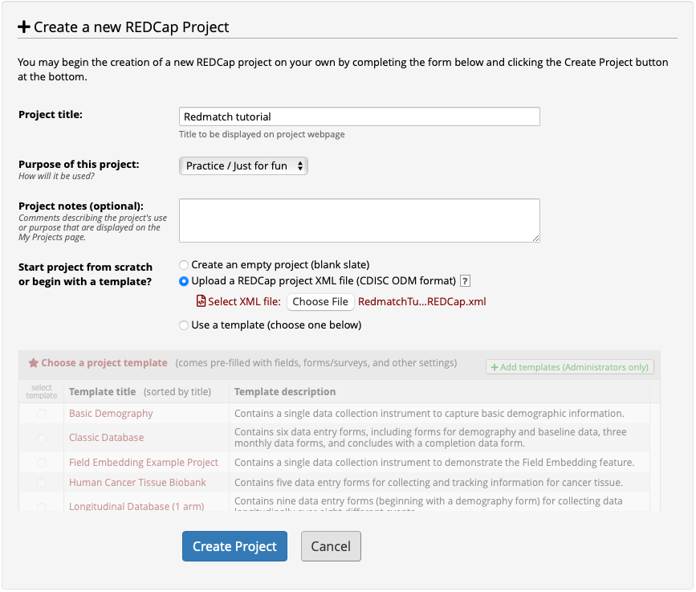
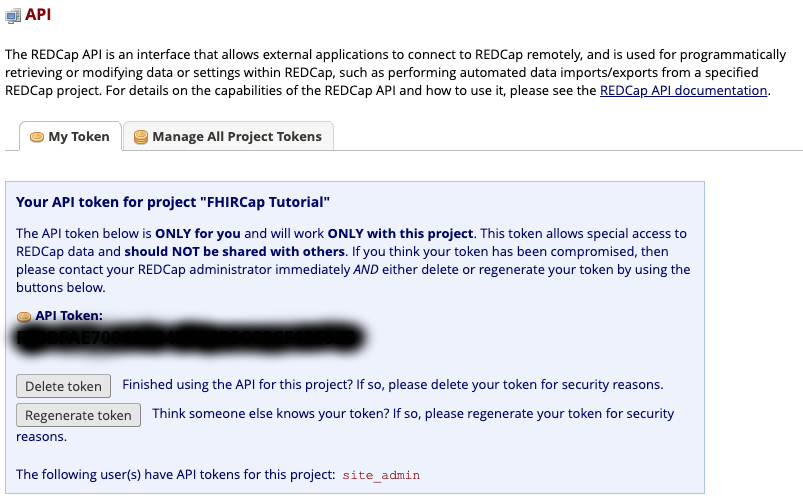

# Redmatch Tutorial

In this tutorial we will use a REDCap form to capture patient data and transform it into a FHIR representation using Redmatch.

## Prerequisites

### REDCap server

This tutorial uses a simple REDCap form that captures patient data to show how Redmatch can be used to transform it into FHIR resources. A REDCap server is required to run the tutorial. Also, the [FHIR Ontology External Module](https://github.com/aehrc/redcap_fhir_ontology_provider) needs to be installed in the REDCap server to run the tutorial, but is not required to use Redmatch. The external module is available in the official [REDCap Repository of External Modules](https://redcap.vanderbilt.edu/consortium/modules/) and can be installed directly from REDCap. Please refer to the REDCap documentation for details on the installation procedure. The module's [GitHub page](https://github.com/aehrc/redcap_fhir_ontology_provider) has documentation on configuration and usage.

### FHIR terminology server

Redmatch uses a FHIR terminology server to validate the transformation rules and to provide auto-complete functionality to the rules editor (this functionality is currently under construction). By default Redmatch uses CSIRO's terminology server, [Ontoserver](http://ontoserver.csiro.au/), which is distributed as a Docker image. However, note that this application is a commercial product and a license is required to download the image from DockerHub. Ontoserver is free for use in Australia but a paid license is required elsewhere.

You can replace Ontoserver with any free FHIR terminology server that supports R4. The code system required for validation is generated by the application.

## Setting up the sample REDCap project

You need to have access to a REDCap instance and have the right permissions to create a project. Installation instructions for REDCap can be found [here](https://projectredcap.org/software/requirements/). This tutorial were developed using REDCap version 8.10.0.

First, click on the "New Project" button in the top menu and create a new REDCap project as shown here:



Click on the "Data Dictionary" button. This will take you to the data dictionary tab where you can download and upload data dictionary files, as shown here:


Click on the "Choose file" button at the bottom of the page, select the sample data dictionary provided [here](RedmatchTutorial_DataDictionary_2020-04-23.csv) and then click on the "Upload File" button. You will be asked to commit your changes as shown here:


Click on the "Commit Changes" button to complete the upload of the data dictionary. You can now inspect the form that was created by navigating to the Online Designer page on your project. You should have a single form called Patient Information, as shown here:


If you click on the "Patient Information" link you will be able to explore the form definition, as shown here:


Redmatch projects are associated with a REDCap report. This allows excluding fields that are not meant to be part of the FHIR representation. Create a report by clicking on the "Data Exports, Reports, and Stats" button on the left hand side menu and then on the "Create New Report" tab. Give the report any name you want and use the "Quick Add" button to add all the elements of the Patient Information form to the report (in this case we are not excluding anything), as shown here:


Click on the "Save Report" button and then on the "View Report" button. We haven't added any records yet so this should display the "View Report" tab with no results.

You should then create some sample patients. You can do this by clicking on the "Add / Edit Records" link on the left hand side menu. Once you have created entries, rerun the report to see the results. We created two sample patients, John and Jane Doe, as shown here:


Finally, Redmatch communicates with REDCap through its API and requires a token to authenticate. You need to request this token to your REDCap administrator. If you are using a local instance you can generate an API token by clicking on the "API" button on the left hand side menu and then on the "Create API token now" button. The token should look like this:



## Running Redmatch
Redmatch is a Spring Boot application and has two external dependencies:

* A MongoDB database, used to store the data.
* A FHIR terminology server, used to validate the transformation rules and provide auto-complete support for the rules editor.

A Docker Compose file is provided in `src/main/docker`. This file creates containers for Redmatch, MongoDB, Ontoserver and Postgres (required by Ontoserver). An image for Ontoserver, with the Redmatch Grammar code system used for validation preloaded, is provided.

The Docker Compose deployment looks like this:


## Creating a Redmatch project

A Redmatch project requires four parameters:

1. A name for the project. This can be any name that will help you identify the project.
2. The id of the report you defined in REDCap. Unfortunately, there is no mechanism to query the report ids through the REDCap API. The easiest way to find the report id is to run the report in REDCap and look at the URL. For example, in this case `http://localhost:8888/redcap/redcap_v8.10.0/DataExport/index.php?pid=36&report_id=7` the report id is 7.
3. The URL of the REDCap API endpoint.
4. The token to access the REDCap API.

The following snippet shows how to create a Redmatch project using cURL:

```
curl --location --request POST 'http://localhost:8080/project' \
--header 'Content-Type: application/json' \
--header 'Accept: application/json' \
--header 'Content-Type: text/plain' \
--data-raw '{
  "name": "Tutorial",
  "reportId": "7",
  "redcapUrl": "http://localhost:8888/redcap/api/", 
  "token": "..."
}'
```

If the project is created successfully, Redmatch should return something like the following:

```
{
   "id":"41694",
   "reportId":"7",
   "redcapUrl":"http://localhost:8888/redcap/api/",
   "name":"Tutorial",
   "metadata":{
      "fields":[
         {
            "fieldType":"TEXT",
            "textValidationType":null,
            "fieldId":"record_id",
            "fieldLabel":"Record ID"
         },
         {
            "fieldType":"TEXT",
            "textValidationType":"NUMBER",
            "fieldId":"pat_medicare",
            "fieldLabel":"Medicare card number:"
         },
         ...
      ],
      "uniqueFieldId":"record_id",
      "fieldIds":[
         "dx_sv_2",
         "pat_sex",
         ...
      ]
   },
   "rulesDocument":"",
   "mappings":[

   ],
   "issues":[

   ]
}
```

You can inspect all the projects in the system by doing a GET on /project, as shown here:

```
curl --location --request GET 'http://localhost:8080/project' \
--header 'Content-Type: application/json' \
--header 'Accept: application/json'
```

The transformation rules need to be uploaded to the application. Using cURL, this can be done using the following command:

```
curl --location --request POST 'http://localhost:8080/project/41694/$update-rules' \
--header 'Content-Type: text/plain' \
--data-raw '// Always create a patient.
TRUE { 
  Patient<p> ->
    identifier.type = CONCEPT_LITERAL(http://hl7.org/fhir/v2/0203|MC),
    identifier.type.text = '\''Medicare Number'\'',
    identifier.system = '\''http://ns.electronichealth.net.au/id/medicare-number'\'',
    identifier.value = VALUE(pat_medicare);
}

// Set the '\''deceased'\'' attribute for the patient depending on the information that is available. This
// is an example of value[x] types.
VALUE(pat_dead) = 1 {
  NOTNULL(pat_dead_date) {
    Patient<p> -> deceasedDateTime = VALUE(pat_dead_date);
  } ELSE {
    Patient<p> -> deceasedBoolean = TRUE;
  }
}

VALUE(pat_dead) = 0 {
  Patient<p> -> deceasedBoolean = FALSE;
}

// The '\''pat_sex'\'' field is a radio button. The condition evaluates to true if any value is selected.
// Because only one value can be selected, at most one resource will be created. The CODE_SELECTED
// expression is used because the gender attribute in a FHIR patient is of type code.
NOTNULL(pat_sex) {
  Patient<p> ->
    gender = CODE_SELECTED(pat_sex);
}

// This rule transforms a pattern that can be used in REDCap to capture multiple items. A drop down
// box is used to indicate how many items are meant to be captured and branching logic is used to
// hide any fields that are not used. Each item can be made up of multiple REDCap form elements.The 
// '\''REPEAT'\'' keyword can be used to write a single rule that will transform all the collections of
// elements, provided that naming conventions are used.
VALUE(dx_num) > 0 {
  REPEAT(1..2: x) // Could also support 1..dx_num to avoid the NOTNULL guard
  // The REDCap FHIR terminology server plugin can set the value of the field to a predetermined
  // value if a code is searched for and not found
  NOTNULL(dx_${x}) {
    VALUE(dx_${x}) = '\''_NRF_'\'' {
      // No code was found so we use the free text
      Condition<c${x}> -> 
        code.text = VALUE(dx_text_${x}),
        subject = REF(Patient<p>);
    } ELSE {
      // We use the code selected using the terminology server. The CONCEPT keyword is used to
      // create a FHIR coding or codeable concept.
      Condition<c${x}> -> 
        code = CONCEPT(dx_${x}),
        subject = REF(Patient<p>);
    }
  }
}

// The '\''phenotype'\'' field is a checkbox. The condition evaluates to true if any value is selected and
// a resource is created for every entry that is selected.
// TODO: we might want to create observations where unchecked boxes are transformed into negative
// phenotypic features. In this case we do need to get the concept mapped to an entry regardless of
// selection
REPEAT(1..4: x)
NOTNULL(phenotype___${x}) {
  Observation<obs${x}> ->
    status = CODE_LITERAL(final),
    code = CONCEPT(phenotype___${x}),
    interpretation = CONCEPT_LITERAL(http://terminology.hl7.org/CodeSystem/v3-ObservationInterpretation|POS);
}

// Some forms use yes / no matrixes to capture information
VALUE(m_weak) = 1 {
  Observation<m_weak> ->
    status = CODE_LITERAL(final),
    code = CONCEPT(m_weak),
    interpretation = CONCEPT_LITERAL(http://terminology.hl7.org/CodeSystem/v3-ObservationInterpretation|POS);
}

VALUE(m_weak) = 0 {
  Observation<m_weak> ->
    status = CODE_LITERAL(final),
    code = CONCEPT(m_weak),
    interpretation = CONCEPT_LITERAL(http://terminology.hl7.org/CodeSystem/v3-ObservationInterpretation|NEG);
}

VALUE(facial) = 1 {
  Observation<facial> ->
    status = CODE_LITERAL(final),
    code = CONCEPT(facial),
    interpretation = CONCEPT_LITERAL(http://terminology.hl7.org/CodeSystem/v3-ObservationInterpretation|POS);
}

VALUE(facial) = 2 {
  Observation<facial> ->
    status = CODE_LITERAL(final),
    code = CONCEPT(facial),
    interpretation = CONCEPT_LITERAL(http://terminology.hl7.org/CodeSystem/v3-ObservationInterpretation|NEG);
}

VALUE(ptosis) = 1 {
  Observation<ptosis> ->
    status = CODE_LITERAL(final),
    code = CONCEPT(ptosis),
    interpretation = CONCEPT_LITERAL(http://terminology.hl7.org/CodeSystem/v3-ObservationInterpretation|POS);
}

VALUE(ptosis) = 2 {
  Observation<ptosis> ->
    status = CODE_LITERAL(final),
    code = CONCEPT(ptosis),
    interpretation = CONCEPT_LITERAL(http://terminology.hl7.org/CodeSystem/v3-ObservationInterpretation|NEG);
}

VALUE(oph) = 1 {
  Observation<oph> ->
    status = CODE_LITERAL(final),
    code = CONCEPT(oph),
    interpretation = CONCEPT_LITERAL(http://terminology.hl7.org/CodeSystem/v3-ObservationInterpretation|POS);
}

VALUE(oph) = 2 {
  Observation<oph> ->
    status = CODE_LITERAL(final),
    code = CONCEPT(oph),
    interpretation = CONCEPT_LITERAL(http://terminology.hl7.org/CodeSystem/v3-ObservationInterpretation|NEG);
}

// Some matrixes have several options
VALUE(left_bicep___1) = 1 {
  Observation<left_bicep> ->
    status = CODE_LITERAL(final),
    code = CONCEPT(left_bicep___1),
    interpretation = CONCEPT_LITERAL(http://terminology.hl7.org/CodeSystem/v3-ObservationInterpretation|POS),
    bodySite = CONCEPT_LITERAL(http://snomed.info/sct|699956003|'\''Biceps brachii muscle and/or tendon structure'\''),
    component[0].code = CONCEPT_LITERAL(http://purl.obolibrary.org/obo/hp.owl|HP:0012831|'\''Laterality'\''),
    component[0].valueCodeableConcept = CONCEPT_LITERAL(http://purl.obolibrary.org/obo/hp.owl|HP:0012835|'\''Left'\'');
}

VALUE(left_bicep___3) = 1 {
  Observation<left_bicep> ->
    status = CODE_LITERAL(final),
    code = CONCEPT(left_bicep___3),
    interpretation = CONCEPT_LITERAL(http://terminology.hl7.org/CodeSystem/v3-ObservationInterpretation|POS),
    bodySite = CONCEPT_LITERAL(http://snomed.info/sct|699956003|'\''Biceps brachii muscle and/or tendon structure'\''),
    component[0].code = CONCEPT_LITERAL(http://purl.obolibrary.org/obo/hp.owl|HP:0012831|'\''Laterality'\''),
    component[0].valueCodeableConcept = CONCEPT_LITERAL(http://purl.obolibrary.org/obo/hp.owl|HP:0012835|'\''Left'\'');
}

VALUE(right_bicep___1) = 1 {
  Observation<right_bicep> ->
    status = CODE_LITERAL(final),
    code = CONCEPT(right_bicep___1),
    interpretation = CONCEPT_LITERAL(http://terminology.hl7.org/CodeSystem/v3-ObservationInterpretation|POS),
    bodySite = CONCEPT_LITERAL(http://snomed.info/sct|699956003|'\''Biceps brachii muscle and/or tendon structure'\''),
    component[0].code = CONCEPT_LITERAL(http://purl.obolibrary.org/obo/hp.owl|HP:0012831|'\''Laterality'\''),
    component[0].valueCodeableConcept = CONCEPT_LITERAL(http://purl.obolibrary.org/obo/hp.owl|HP:0012834|'\''Right'\'');
}

VALUE(right_bicep___3) = 1 {
  Observation<right_bicep> ->
    status = CODE_LITERAL(final),
    code = CONCEPT(right_bicep___3),
    interpretation = CONCEPT_LITERAL(http://terminology.hl7.org/CodeSystem/v3-ObservationInterpretation|POS),
    bodySite = CONCEPT_LITERAL(http://snomed.info/sct|699956003|'\''Biceps brachii muscle and/or tendon structure'\''),
    component[0].code = CONCEPT_LITERAL(http://purl.obolibrary.org/obo/hp.owl|HP:0012831|'\''Laterality'\''),
    component[0].valueCodeableConcept = CONCEPT_LITERAL(http://purl.obolibrary.org/obo/hp.owl|HP:0012834|'\''Right'\'');
}

VALUE(left_tricep___1) = 1 {
  Observation<left_tricep> ->
    status = CODE_LITERAL(final),
    code = CONCEPT(left_tricep___1),
    interpretation = CONCEPT_LITERAL(http://terminology.hl7.org/CodeSystem/v3-ObservationInterpretation|POS),
    bodySite = CONCEPT_LITERAL(http://snomed.info/sct|699996001|'\''Triceps brachii muscle and/or tendon structure'\''),
    component[0].code = CONCEPT_LITERAL(http://purl.obolibrary.org/obo/hp.owl|HP:0012831|'\''Laterality'\''),
    component[0].valueCodeableConcept = CONCEPT_LITERAL(http://purl.obolibrary.org/obo/hp.owl|HP:0012835|'\''Left'\'');
}

VALUE(left_tricep___3) = 1 {
  Observation<left_tricep> ->
    status = CODE_LITERAL(final),
    code = CONCEPT(left_tricep___3),
    interpretation = CONCEPT_LITERAL(http://terminology.hl7.org/CodeSystem/v3-ObservationInterpretation|POS),
    bodySite = CONCEPT_LITERAL(http://snomed.info/sct|699996001|'\''Triceps brachii muscle and/or tendon structure'\''),
    component[0].code = CONCEPT_LITERAL(http://purl.obolibrary.org/obo/hp.owl|HP:0012831|'\''Laterality'\''),
    component[0].valueCodeableConcept = CONCEPT_LITERAL(http://purl.obolibrary.org/obo/hp.owl|HP:0012835|'\''Left'\'');
}

VALUE(right_tricep___1) = 1 {
  Observation<right_tricep> ->
    status = CODE_LITERAL(final),
    code = CONCEPT(right_tricep___1),
    interpretation = CONCEPT_LITERAL(http://terminology.hl7.org/CodeSystem/v3-ObservationInterpretation|POS),
    bodySite = CONCEPT_LITERAL(http://snomed.info/sct|699996001|'\''Triceps brachii muscle and/or tendon structure'\''),
    component[0].code = CONCEPT_LITERAL(http://purl.obolibrary.org/obo/hp.owl|HP:0012831|'\''Laterality'\''),
    component[0].valueCodeableConcept = CONCEPT_LITERAL(http://purl.obolibrary.org/obo/hp.owl|HP:0012834|'\''Right'\'');
}

VALUE(right_tricep___3) = 1 {
  Observation<right_tricep> ->
    status = CODE_LITERAL(final),
    code = CONCEPT(right_tricep___3),
    interpretation = CONCEPT_LITERAL(http://terminology.hl7.org/CodeSystem/v3-ObservationInterpretation|POS),
    bodySite = CONCEPT_LITERAL(http://snomed.info/sct|699996001|'\''Triceps brachii muscle and/or tendon structure'\''),
    component[0].code = CONCEPT_LITERAL(http://purl.obolibrary.org/obo/hp.owl|HP:0012831|'\''Laterality'\''),
    component[0].valueCodeableConcept = CONCEPT_LITERAL(http://purl.obolibrary.org/obo/hp.owl|HP:0012834|'\''Right'\'');
}
'
```

The response will show that the project now has mappings for these rules and the rules are now stored in the 'rulesDocument' attribute, as shown here:

```
{
   "id":"41694",
   "reportId":"7",
   "redcapUrl":"http://localhost:8888/redcap/api/",
   "name":"Tutorial",
   "metadata":{
      "fields":[
         {
            "fieldType":"TEXT",
            "textValidationType":null,
            "fieldId":"record_id",
            "fieldLabel":"Record ID"
         },
         {
            "fieldType":"TEXT",
            "textValidationType":"NUMBER",
            "fieldId":"pat_medicare",
            "fieldLabel":"Medicare card number:"
         },
         ...
      ],
      "uniqueFieldId":"record_id",
      "fieldIds":[
         "dx_sv_2",
         "pat_sex",
         ..."
      ]
   },
   "rulesDocument":"// Always create a patient.\nTRUE { \n  Patient<p> ->...",
   "mappings":[
      {
         "id":null,
         "redcapFieldId":"pat_sex___1",
         "redcapLabel":"Male",
         "redcapFieldType":"DROPDOW_OR_RADIO_OPTION",
         "targetSystem":null,
         "targetCode":null,
         "targetDisplay":null
      },
      {
         "id":null,
         "redcapFieldId":"pat_sex___2",
         "redcapLabel":"Female",
         "redcapFieldType":"DROPDOW_OR_RADIO_OPTION",
         "targetSystem":null,
         "targetCode":null,
         "targetDisplay":null
      },
      ...
   ],
   "issues":[

   ]
}
```

Notice that the rules have no compilation errors, so the 'issues' attribute is empty. If a malformed rules document is uploaded, it will still be processed but any issues will be stored in this attribute.

The rules allow transforming the data in the REDCap forms into FHIR resources. A transformation can be triggered by running the following:

```
curl --location --request POST 'http://localhost:8080/project/41694/$transform'
```

You will notice that running this command results if the following error:

```
The project could not be transformed to FHIR because a mapping is missing. Please check your mappings. Error message: Mapping to a code for field Male (pat_sex___1) is required but was not found.
```

Any codes that are defined in REDCap, for example, in a drop down box, need to be mapped to standardised codes before the data can be transformed to FHIR. To download a spreadsheet with the codes that need to be mapped run the following command:

```
curl --location --request GET 'http://localhost:8080/project/41694/mapping' \  
--header 'Accept: application/vnd.ms-excel' --output 'mappings.xls'
```

Then, define the mappings in the 'mappings.xls' file and upload it to the server. A completed file is available [here](mappings.xls) and looks like this:


The file can be uploaded by running the following command:

```
curl --location --request POST 'http://localhost:8080/project/41694/$import-mappings' \
--form 'file=@/yourpath/mappings.xls'
```

Now, the transformation to FHIR can be run successfully. The results show look like this:

```
{
   "resourceType":"Bundle",
   "type":"transaction",
   "entry":[
      {
         "resource":{
            "resourceType":"Observation",
            "id":"right_tricep-1",
            "status":"final",
            "code":{
               "coding":[
                  {
                     "system":"http://purl.obolibrary.org/obo/hp.owl",
                     "code":"HP:0001252",
                     "display":"Muscular hypotonia"
                  }
               ]
            },
            "interpretation":[
               {
                  "coding":[
                     {
                        "system":"http://terminology.hl7.org/CodeSystem/v3-ObservationInterpretation",
                        "code":"POS"
                     }
                  ]
               }
            ],
            "bodySite":{
               "coding":[
                  {
                     "system":"http://snomed.info/sct",
                     "code":"699996001",
                     "display":"Triceps brachii muscle and/or tendon structure"
                  }
               ]
            },
            "component":[
               {
                  "code":{
                     "coding":[
                        {
                           "system":"http://purl.obolibrary.org/obo/hp.owl",
                           "code":"HP:0012831",
                           "display":"Laterality"
                        }
                     ]
                  },
                  "valueCodeableConcept":{
                     "coding":[
                        {
                           "system":"http://purl.obolibrary.org/obo/hp.owl",
                           "code":"HP:0012834",
                           "display":"Right"
                        }
                     ]
                  }
               }
            ]
         },
         "request":{
            "method":"PUT",
            "url":"Observation/right_tricep-1"
         }
      },
      {
         "resource":{
            "resourceType":"Observation",
            "id":"left_bicep-2",
            "status":"final",
            "code":{
               "coding":[
                  {
                     "system":"http://purl.obolibrary.org/obo/hp.owl",
                     "code":"HP:0001276",
                     "display":"Hypertonia"
                  }
               ]
            },
            "interpretation":[
               {
                  "coding":[
                     {
                        "system":"http://terminology.hl7.org/CodeSystem/v3-ObservationInterpretation",
                        "code":"POS"
                     }
                  ]
               }
            ],
            "bodySite":{
               "coding":[
                  {
                     "system":"http://snomed.info/sct",
                     "code":"699956003",
                     "display":"Biceps brachii muscle and/or tendon structure"
                  }
               ]
            },
            "component":[
               {
                  "code":{
                     "coding":[
                        {
                           "system":"http://purl.obolibrary.org/obo/hp.owl",
                           "code":"HP:0012831",
                           "display":"Laterality"
                        }
                     ]
                  },
                  "valueCodeableConcept":{
                     "coding":[
                        {
                           "system":"http://purl.obolibrary.org/obo/hp.owl",
                           "code":"HP:0012835",
                           "display":"Left"
                        }
                     ]
                  }
               }
            ]
         },
         "request":{
            "method":"PUT",
            "url":"Observation/left_bicep-2"
         }
      },
      {
         "resource":{
            "resourceType":"Observation",
            "id":"facial-1",
            "status":"final",
            "code":{
               "coding":[
                  {
                     "system":"http://purl.obolibrary.org/obo/hp.owl",
                     "code":"HP:0010628",
                     "display":"Facial palsy"
                  }
               ]
            },
            "interpretation":[
               {
                  "coding":[
                     {
                        "system":"http://terminology.hl7.org/CodeSystem/v3-ObservationInterpretation",
                        "code":"NEG"
                     }
                  ]
               }
            ]
         },
         "request":{
            "method":"PUT",
            "url":"Observation/facial-1"
         }
      },
      {
         "resource":{
            "resourceType":"Observation",
            "id":"ptosis-1",
            "status":"final",
            "code":{
               "coding":[
                  {
                     "system":"http://purl.obolibrary.org/obo/hp.owl",
                     "code":"HP:0000508",
                     "display":"Ptosis"
                  }
               ]
            },
            "interpretation":[
               {
                  "coding":[
                     {
                        "system":"http://terminology.hl7.org/CodeSystem/v3-ObservationInterpretation",
                        "code":"POS"
                     }
                  ]
               }
            ]
         },
         "request":{
            "method":"PUT",
            "url":"Observation/ptosis-1"
         }
      },
      {
         "resource":{
            "resourceType":"Observation",
            "id":"m_weak-2",
            "status":"final",
            "code":{
               "coding":[
                  {
                     "system":"http://purl.obolibrary.org/obo/hp.owl",
                     "code":"HP:0001324",
                     "display":"Muscle weakness"
                  }
               ]
            },
            "interpretation":[
               {
                  "coding":[
                     {
                        "system":"http://terminology.hl7.org/CodeSystem/v3-ObservationInterpretation",
                        "code":"NEG"
                     }
                  ]
               }
            ]
         },
         "request":{
            "method":"PUT",
            "url":"Observation/m_weak-2"
         }
      },
      {
         "resource":{
            "resourceType":"Observation",
            "id":"m_weak-1",
            "status":"final",
            "code":{
               "coding":[
                  {
                     "system":"http://purl.obolibrary.org/obo/hp.owl",
                     "code":"HP:0001324",
                     "display":"Muscle weakness"
                  }
               ]
            },
            "interpretation":[
               {
                  "coding":[
                     {
                        "system":"http://terminology.hl7.org/CodeSystem/v3-ObservationInterpretation",
                        "code":"POS"
                     }
                  ]
               }
            ]
         },
         "request":{
            "method":"PUT",
            "url":"Observation/m_weak-1"
         }
      },
      {
         "resource":{
            "resourceType":"Observation",
            "id":"obs3-1",
            "status":"final",
            "code":{
               "coding":[
                  {
                     "system":"http://purl.obolibrary.org/obo/hp.owl",
                     "code":"HP:0031910",
                     "display":"Abnormal cranial nerve physiology"
                  }
               ]
            },
            "interpretation":[
               {
                  "coding":[
                     {
                        "system":"http://terminology.hl7.org/CodeSystem/v3-ObservationInterpretation",
                        "code":"POS"
                     }
                  ]
               }
            ]
         },
         "request":{
            "method":"PUT",
            "url":"Observation/obs3-1"
         }
      },
      {
         "resource":{
            "resourceType":"Patient",
            "id":"p-2",
            "identifier":[
               {
                  "type":{
                     "coding":[
                        {
                           "system":"http://hl7.org/fhir/v2/0203",
                           "code":"MC"
                        }
                     ],
                     "text":"Medicare Number"
                  },
                  "system":"http://ns.electronichealth.net.au/id/medicare-number",
                  "value":"9876543211"
               }
            ],
            "gender":"female",
            "deceasedDateTime":"2020-04-02T00:00:00+00:00"
         },
         "request":{
            "method":"PUT",
            "url":"Patient/p-2"
         }
      },
      {
         "resource":{
            "resourceType":"Observation",
            "id":"obs2-2",
            "status":"final",
            "code":{
               "coding":[
                  {
                     "system":"http://purl.obolibrary.org/obo/hp.owl",
                     "code":"HP:0001270",
                     "display":"Motor delay"
                  }
               ]
            },
            "interpretation":[
               {
                  "coding":[
                     {
                        "system":"http://terminology.hl7.org/CodeSystem/v3-ObservationInterpretation",
                        "code":"POS"
                     }
                  ]
               }
            ]
         },
         "request":{
            "method":"PUT",
            "url":"Observation/obs2-2"
         }
      },
      {
         "resource":{
            "resourceType":"Patient",
            "id":"p-1",
            "identifier":[
               {
                  "type":{
                     "coding":[
                        {
                           "system":"http://hl7.org/fhir/v2/0203",
                           "code":"MC"
                        }
                     ],
                     "text":"Medicare Number"
                  },
                  "system":"http://ns.electronichealth.net.au/id/medicare-number",
                  "value":"12345678911"
               }
            ],
            "gender":"male",
            "deceasedBoolean":false
         },
         "request":{
            "method":"PUT",
            "url":"Patient/p-1"
         }
      },
      {
         "resource":{
            "resourceType":"Observation",
            "id":"obs2-1",
            "status":"final",
            "code":{
               "coding":[
                  {
                     "system":"http://purl.obolibrary.org/obo/hp.owl",
                     "code":"HP:0001270",
                     "display":"Motor delay"
                  }
               ]
            },
            "interpretation":[
               {
                  "coding":[
                     {
                        "system":"http://terminology.hl7.org/CodeSystem/v3-ObservationInterpretation",
                        "code":"POS"
                     }
                  ]
               }
            ]
         },
         "request":{
            "method":"PUT",
            "url":"Observation/obs2-1"
         }
      },
      {
         "resource":{
            "resourceType":"Observation",
            "id":"obs1-2",
            "status":"final",
            "code":{
               "coding":[
                  {
                     "system":"http://purl.obolibrary.org/obo/hp.owl",
                     "code":"HP:0001558",
                     "display":"Decreased fetal movement"
                  }
               ]
            },
            "interpretation":[
               {
                  "coding":[
                     {
                        "system":"http://terminology.hl7.org/CodeSystem/v3-ObservationInterpretation",
                        "code":"POS"
                     }
                  ]
               }
            ]
         },
         "request":{
            "method":"PUT",
            "url":"Observation/obs1-2"
         }
      },
      {
         "resource":{
            "resourceType":"Observation",
            "id":"obs1-1",
            "status":"final",
            "code":{
               "coding":[
                  {
                     "system":"http://purl.obolibrary.org/obo/hp.owl",
                     "code":"HP:0001558",
                     "display":"Decreased fetal movement"
                  }
               ]
            },
            "interpretation":[
               {
                  "coding":[
                     {
                        "system":"http://terminology.hl7.org/CodeSystem/v3-ObservationInterpretation",
                        "code":"POS"
                     }
                  ]
               }
            ]
         },
         "request":{
            "method":"PUT",
            "url":"Observation/obs1-1"
         }
      },
      {
         "resource":{
            "resourceType":"Observation",
            "id":"obs4-2",
            "status":"final",
            "code":{
               "coding":[
                  {
                     "system":"http://purl.obolibrary.org/obo/hp.owl",
                     "code":"HP:0012587",
                     "display":"Macroscopic hematuria"
                  }
               ]
            },
            "interpretation":[
               {
                  "coding":[
                     {
                        "system":"http://terminology.hl7.org/CodeSystem/v3-ObservationInterpretation",
                        "code":"POS"
                     }
                  ]
               }
            ]
         },
         "request":{
            "method":"PUT",
            "url":"Observation/obs4-2"
         }
      },
      {
         "resource":{
            "resourceType":"Observation",
            "id":"obs4-1",
            "status":"final",
            "code":{
               "coding":[
                  {
                     "system":"http://purl.obolibrary.org/obo/hp.owl",
                     "code":"HP:0012587",
                     "display":"Macroscopic hematuria"
                  }
               ]
            },
            "interpretation":[
               {
                  "coding":[
                     {
                        "system":"http://terminology.hl7.org/CodeSystem/v3-ObservationInterpretation",
                        "code":"POS"
                     }
                  ]
               }
            ]
         },
         "request":{
            "method":"PUT",
            "url":"Observation/obs4-1"
         }
      },
      {
         "resource":{
            "resourceType":"Observation",
            "id":"oph-1",
            "status":"final",
            "code":{
               "coding":[
                  {
                     "system":"http://purl.obolibrary.org/obo/hp.owl",
                     "code":"HP:0000602",
                     "display":"Ophthalmoplegia"
                  }
               ]
            },
            "interpretation":[
               {
                  "coding":[
                     {
                        "system":"http://terminology.hl7.org/CodeSystem/v3-ObservationInterpretation",
                        "code":"NEG"
                     }
                  ]
               }
            ]
         },
         "request":{
            "method":"PUT",
            "url":"Observation/oph-1"
         }
      },
      {
         "resource":{
            "resourceType":"Observation",
            "id":"obs3-2",
            "status":"final",
            "code":{
               "coding":[
                  {
                     "system":"http://purl.obolibrary.org/obo/hp.owl",
                     "code":"HP:0031910",
                     "display":"Abnormal cranial nerve physiology"
                  }
               ]
            },
            "interpretation":[
               {
                  "coding":[
                     {
                        "system":"http://terminology.hl7.org/CodeSystem/v3-ObservationInterpretation",
                        "code":"POS"
                     }
                  ]
               }
            ]
         },
         "request":{
            "method":"PUT",
            "url":"Observation/obs3-2"
         }
      },
      {
         "resource":{
            "resourceType":"Condition",
            "id":"c2-1",
            "code":{
               "text":"CAKUT"
            },
            "subject":{
               "reference":"Patient/p-1"
            }
         },
         "request":{
            "method":"PUT",
            "url":"Condition/c2-1"
         }
      },
      {
         "resource":{
            "resourceType":"Condition",
            "id":"c1-2",
            "code":{
               "coding":[
                  {
                     "system":"http://snomed.info/sct",
                     "code":"73211009",
                     "display":"Diabetes mellitus"
                  }
               ]
            },
            "subject":{
               "reference":"Patient/p-2"
            }
         },
         "request":{
            "method":"PUT",
            "url":"Condition/c1-2"
         }
      },
      {
         "resource":{
            "resourceType":"Condition",
            "id":"c1-1",
            "code":{
               "coding":[
                  {
                     "system":"http://snomed.info/sct",
                     "code":"74400008",
                     "display":"Appendicitis"
                  }
               ]
            },
            "subject":{
               "reference":"Patient/p-1"
            }
         },
         "request":{
            "method":"PUT",
            "url":"Condition/c1-1"
         }
      }
   ]
}
```

That's it! You have successfully transformed a REDCap project into standardised FHIR resources by defining transformation rules. To learn more about the Redmatch grammar checkout the [Redmatch reference documentation](reference.md).
